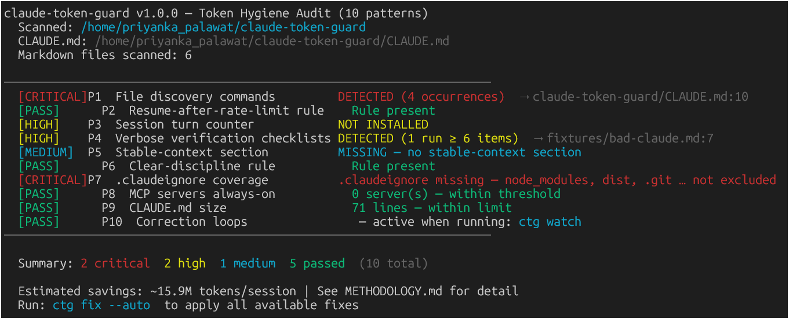
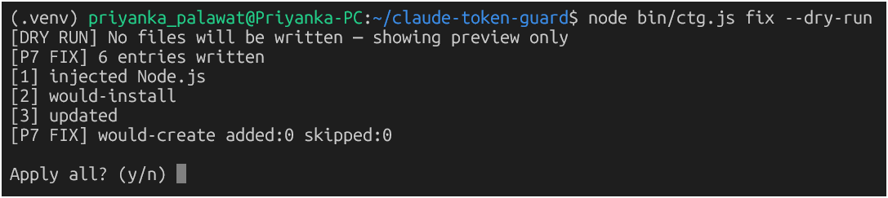
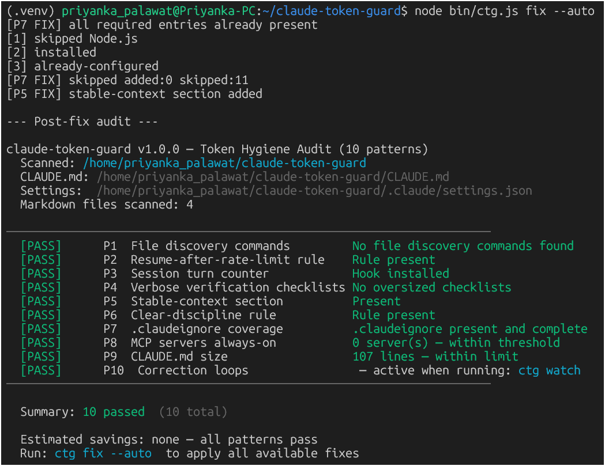
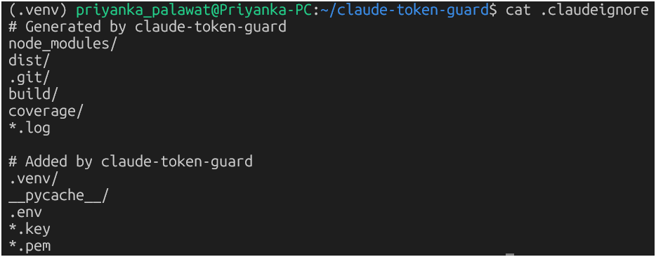
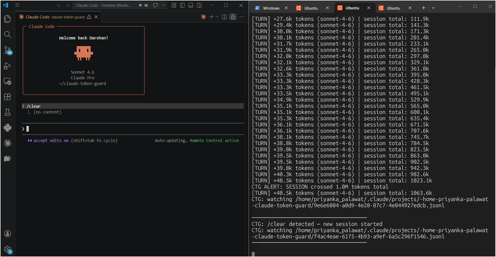
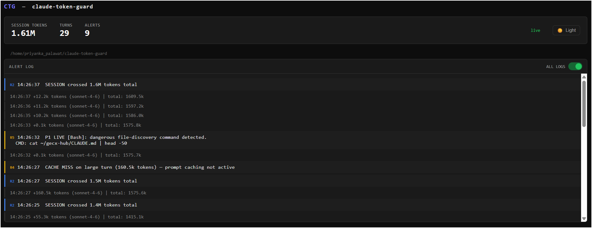

# claude-token-guard

> ESLint for your Claude Code setup. Audit anti-patterns, auto-fix them, monitor live.



If you've ever hit 100% context mid-task with zero idea what caused it — this tool is for you.

The community has great tools for tracking **how much** you spend. `claude-token-guard` tells you **why** you're burning tokens and fixes it automatically.

---

## The Problem

One day I went from 69% → 100% context in a single prompt. Just stared at the screen.

I was already using monitoring tools. None of them told me what was misconfigured in my project. After digging through session logs and Claude Code docs I found 10 repeatable anti-patterns that silently drain context every single turn — bad `.claudeignore` entries, file discovery commands baked into `CLAUDE.md`, bloated checklists, no stable-context section. Fixable things. Nobody was linting for them.

So I built `ctg`.

---

## Install

```bash
npm install -g claude-token-guard
ctg audit
```

---

## Commands

### `ctg audit`
Scans your project against 10 anti-patterns. Tells you what's wrong, exactly where, and estimated token impact.


### `ctg fix --dry-run`
Preview every change before anything is touched.



### `ctg fix --auto`
Auto-fixes what's safe: creates `.claudeignore`, injects a stable-context section into `CLAUDE.md`, installs session hooks, updates settings.




### `ctg watch`
Tails your Claude Code JSONL session in real-time. Fires alerts on token spikes and correction loops as they happen.



### `ctg dashboard`
Live browser UI that updates as you code — token counter, spike alerts, session history, dark/light mode. Keep it on a second monitor the same way you keep logs open.



### `ctg test`
Run built-in anti-pattern scenarios to validate all 10 detection rules are working correctly.

---

## The 10 Anti-Patterns

| ID | Severity | Pattern | Why It Hurts |
|---|---|---|---|
| P1 | CRITICAL | File discovery commands in CLAUDE.md | `grep -r ~/` causes Claude to scan directories every single turn |
| P2 | CRITICAL | No resume-after-rate-limit rule | Claude restarts context from scratch after rate limits |
| P3 | HIGH | No session turn counter hook | No guard against runaway sessions |
| P4 | HIGH | Verbose verification checklists | 6+ item checklists re-read in full every turn |
| P5 | MEDIUM | No stable-context section | Claude re-discovers your architecture repeatedly |
| P6 | MEDIUM | No /clear discipline rule | Context bloat across unrelated tasks |
| P7 | CRITICAL | Incomplete `.claudeignore` | Claude sees node_modules, dist, .git — hundreds of irrelevant files |
| P8 | HIGH | Always-on MCP servers | Every connected server adds overhead per turn |
| P9 | MEDIUM | Bloated CLAUDE.md | >150 lines injected into context every turn |
| P10 | HIGH | Correction loops | Repeating the same ask 5 ways — Claude answers each time |

---

## How It Compares

| Tool | What it does |
|---|---|
| `ccusage` | Tracks how much you spent |
| RTK / session trackers | Tracks session stats |
| **claude-token-guard** | Audits why you're spending it + fixes it |

Think of the others as monitoring. Think of `ctg` as the linter you run first.

---

## Before / After

After fixing P1, P5, P7 on my main project — sessions started running to completion.
The audit flagged ~18M tokens/session in estimated waste. Even half that is a lot of prompts burned for nothing.

---

## Roadmap / Contributing

- [ ] VS Code sidebar integration
- [ ] Team shared config via `.ctgrc`
- [ ] More anti-pattern rules

Hit a pattern that killed your session? **Open an issue** — I'll add detection for it.

If this saves you tokens, a ⭐ helps more developers find it.

---

## License
MIT